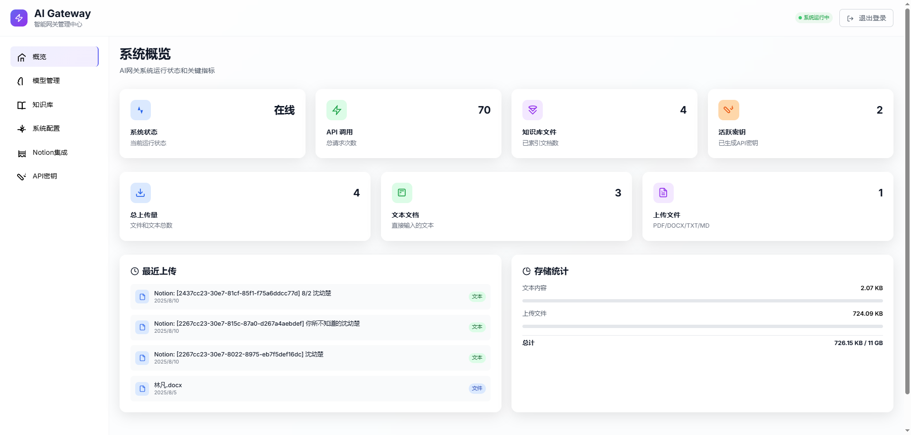
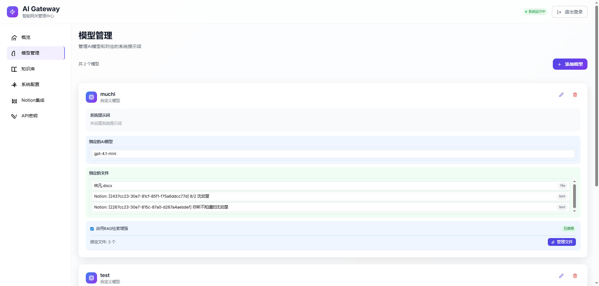
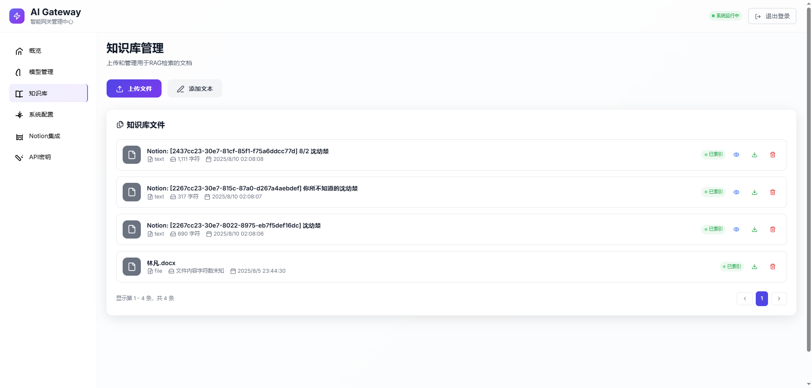
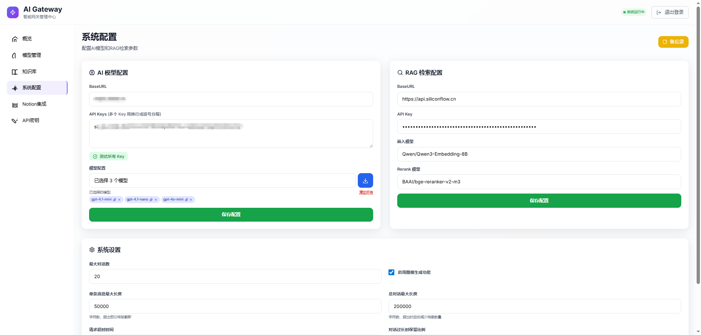
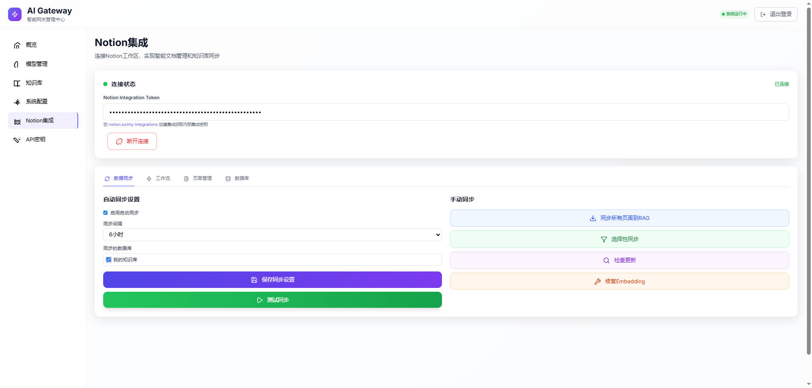
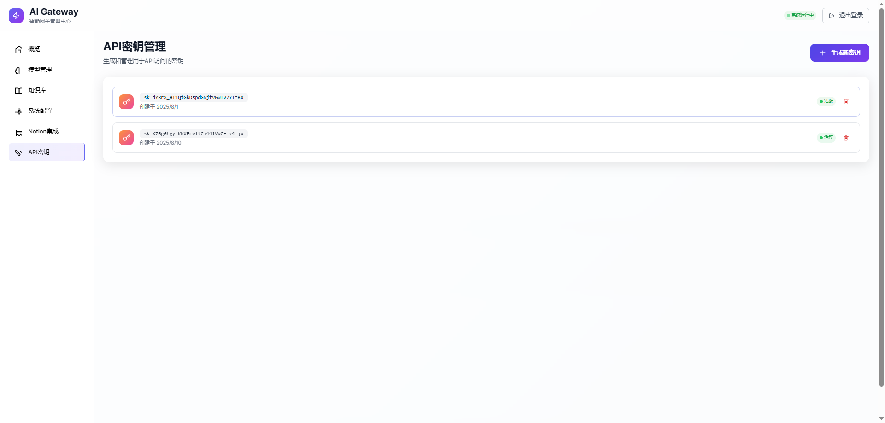

# SmartChat Engine 🚀

[English](README.md) | [中文](README.zh.md)

[](https://opensource.org/licenses/MIT) [](https://workers.cloudflare.com/) [](https://openai.com/api/)

一个强大的 **AI 智能对话平台** 和 **RAG（检索增强生成）** 系统，基于 **Cloudflare Workers** 构建，为各种应用提供智能对话能力、文件管理和知识检索功能。

## ✨ 功能特性

- 🤖 **智能对话**: 提供 OpenAI 兼容的聊天 API，支持智能对话
- 📚 **RAG 系统**: 支持文件上传和知识库智能检索
- 🔗 **模型文件绑定**: 为每个模型绑定特定文件，实现精确的 RAG 检索
- 🔐 **API 密钥管理**: 自定义 API 密钥系统，支持用户隔离
- 🎨 **图片生成**: 集成 AI 图片生成功能
- 📊 **管理界面**: 现代化的 Web 管理面板
- 🌐 **多用户支持**: API 密钥隔离，支持多用户使用
- 📄 **Notion 集成**: 与 Notion 工作区同步，进行内容管理
- 🔄 **流式支持**: 实时流式响应
- 📈 **使用分析**: 跟踪 API 使用情况和统计信息

## 📸 界面截图








## 🎯 应用场景

### 🤖 网站 AI 客服
构建智能客服系统，可以：
- 即时回答常见问题
- 通过 RAG 知识库处理产品咨询
- 将复杂问题转交给人工客服

### 📚 知识库助手
创建智能问答系统：
- 企业内部文档查询
- 技术支持知识库
- 教育内容辅助
- 研究论文分析

### 🛒 电商购物顾问
增强购物体验：
- 产品推荐
- 尺寸和兼容性指导
- 订单跟踪和支持
- 个性化购物建议

## 🏗️ 系统架构

### 核心组件

- **Cloudflare Workers**: 主应用逻辑和 API 端点
- **Cloudflare Pages**: Web 管理界面
- **KV 存储**: 配置和 API 密钥存储
- **D1 数据库**: 文件内容和对话历史存储
- **R2 存储**: 上传文件的云存储

### 请求流程

1. 客户端调用 `/v1/chat/completions` 接口
2. API 密钥验证
3. RAG 检索（可选）
4. 模型路由和转发
5. 响应处理和返回
6. 对话历史存储

## 🚀 快速开始

### 环境要求

- Node.js 16+
- Cloudflare 账号
- Wrangler CLI

### 安装步骤

1. **克隆仓库**
   ```bash
   git clone https://github.com/your-username/smartchat-engine.git
   cd smartchat-engine
   ```

2. **安装依赖**
   ```bash
   npm install
   ```

3. **登录 Cloudflare**
   ```bash
   wrangler login
   ```

4. **创建资源**
   ```bash
   # 创建 KV 命名空间
   wrangler kv:namespace create "AI_KV"
   
   # 创建 D1 数据库
   wrangler d1 create ai-gateway-db
   
   # 创建 R2 存储桶
   wrangler r2 bucket create ai-gateway-files
   ```

5. **配置项目**
   
   编辑 `wrangler.toml` 文件，替换资源 ID：
   ```toml
   [[kv_namespaces]]
   binding = "AI_KV"
   id = "你的KV_ID"
   
   [[d1_databases]]
   binding = "AI_DB"
   database_name = "ai-gateway-db"
   database_id = "你的D1_ID"
   
   [[r2_buckets]]
   binding = "AI_R2"
   bucket_name = "ai-gateway-files"
   ```

6. **初始化数据库**
   ```bash
   wrangler d1 execute ai-gateway-db --file=./complete-setup.sql --env production
   ```

7. **配置域名**
   
   编辑 `app.js` 第2行，修改API地址为你的实际域名：
   ```javascript
   let API_BASE_URL = 'https://your-worker-domain.workers.dev';
   ```

8. **部署项目**
   ```bash
   # 部署 Worker
   wrangler deploy --env production
   
   # 部署管理界面
   wrangler pages publish . --project-name smartchat-admin
   ```

## 💻 使用指南

### 管理界面

1. 首次访问会自动进入设置页面
2. 配置 AI 服务（BaseURL、API 密钥、模型）
3. 设置 RAG 模型（嵌入和重排序）
4. 生成用户 API 密钥

### API 使用

#### 智能对话
```bash
curl -X POST https://your-domain/v1/chat/completions \
  -H "Content-Type: application/json" \
  -H "Authorization: Bearer sk-your-api-key" \
  -d '{
    "model": "gpt-3.5-turbo",
    "messages": [
      {"role": "user", "content": "你好，请问今天能为您做些什么？"}
    ],
    "stream": false
  }'
```

#### 客服系统示例
```bash
curl -X POST https://your-domain/v1/chat/completions \
  -H "Content-Type: application/json" \
  -H "Authorization: Bearer sk-your-api-key" \
  -d '{
    "model": "customer-service-bot",
    "messages": [
      {"role": "user", "content": "请问你们的退货政策是什么？"}
    ]
  }'
```

#### 支持的参数
- `model`: 模型名称
- `messages`: 消息数组
- `temperature`: 温度参数 (0-1)
- `max_tokens`: 最大令牌数
- `stream`: 启用流式响应

### 模型文件绑定

为每个模型绑定特定文件，实现精确的 RAG 检索：

1. **绑定文件**：点击模型标签上的回形针图标
2. **选择文件**：从已上传的文件中选择
3. **生效机制**：启用 RAG 时，只使用绑定的文件
4. **默认行为**：如果没有绑定，使用所有文件

## 📁 项目结构

```
├── worker.js              # Workers 主程序
├── index.html             # 管理界面 HTML
├── app.js                 # 前端 JavaScript
├── complete-setup.sql     # 数据库架构
├── wrangler.toml          # Workers 配置
├── wrangler-pages.toml    # Pages 配置
├── package.json           # 依赖管理
├── README.md              # 英文文档
└── README.zh.md           # 中文文档
```

## 🛠️ 开发命令

```bash
# 本地开发
npm run dev

# 部署到生产环境
npm run deploy

# 查看日志
npm run tail

# 数据库操作
wrangler d1 execute ai-gateway-db --command="SELECT * FROM files LIMIT 10" --env production
```

## 📖 API 参考

### 认证接口
- `POST /api/setup` - 初始化设置
- `POST /api/login` - 管理员登录
- `POST /api/logout` - 管理员登出

### 配置接口
- `GET /api/config` - 获取配置
- `POST /api/config` - 更新配置
- `GET /api/models` - 获取模型列表

### 文件管理
- `POST /api/upload` - 上传文件
- `GET /api/files` - 获取文件列表
- `DELETE /api/files/:id` - 删除文件

### API 密钥
- `GET /api/keys` - 获取 API 密钥列表
- `POST /api/keys` - 创建 API 密钥
- `DELETE /api/keys/:id` - 删除 API 密钥

## 📄 许可证

本项目采用 MIT 许可证 - 查看 [LICENSE](LICENSE) 文件了解详情。

## 🆘 技术支持

如遇到问题，请：
- 搜索现有[问题](https://github.com/xliking/smartchat/issues)
- 创建新的 issue 并提供详细信息

---
